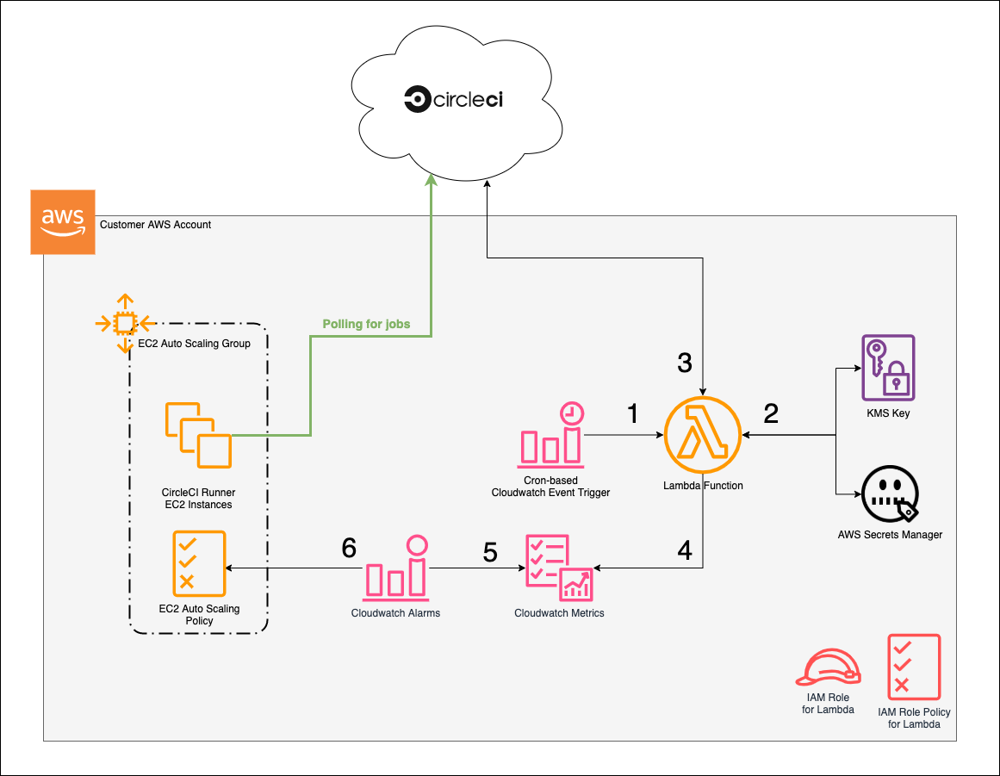

# circleci-runner-terraform
Terraform plan to deploy an autoscaling CircleCI Runner cluster.

## Requirements

- Terraform (>= 0.13.6)
- CircleCI CLI (>= 0.1.11924)

## Architecture

The diagram below shows how the infrastructure deployed by thisTerraform plan works.  

Some general notes about how the plan works:
* An Auto Scaling group (ASG) will be deployed with a launch template for automatically installing Runner on Server.  
    * The ASG will start with min/max values specified by the user when supplying variables for the Terraform plan.  
* A Lambda function will also be deployed to check the CircleCI API for the current queue depth for the resource class represented by the servers running in the ASG.   
    * This function will retrieve the queue depth value and post the value to Cloudwatch. 
    * If a user-specified queue depth is exceeded, Cloudwatch will notify EC2 Auto Scaling to trigger a scale-out event.  
    * When the queue depth is below a certain threshold for a certain (configurable) amount of time, Cloudwatch will notify EC2 Auto Scaling to trigger a scale-in event.  

The scale-out process is shown by the numbers on the diagram, which represent these steps that occur in order:

1. A cron-based Cloudwatch alarm triggers a Lambda function that will check the current queue depth.
2. The Lambda function retrieves the user-supplied CircleCI API token and resource class name from AWS Secrets Manager using a KMS key.
3. The Lambda function requests the current queue depth from the CircleCI Runner API.
4. The queue depth value is sent to a Cloudwatch metric.
5. A Cloudwatch alarm monitors the metric. 
6. If the metric exceeds a specified threshold, it notifies the Auto Scaling group, which then executes a scaling action according to its policies. 

## How to Use

1. Create a namespace, resource class, and runner token as described in [the documentation.](https://circleci.com/docs/2.0/runner-installation/#authentication)
1. Open `terraform.tfvars.example` and replace required values
2. Check optional values to ensure the runners are configured appropriately for your use case
3. (Optional, but strongly recommended) Add a [remote state backend](https://www.terraform.io/docs/language/settings/backends/index.html) to store your terraform state
3. Run `terraform plan` and inspect proposed changes
4. Run `terraform apply` to apply changes
5. Verify that runners are registered with your CircleCI org by using the command `circleci runner instance list <your-org-namespace-here>`

**Optional:** If you would like to do a sandbox deploy to test the Terraform plan using CircleCI, follow these steps:

1. Enter the necessary values in terraform.tfvars.example and save your changes
2. Run the following bash command: `base64 terraform.tfvars.example > base64_tfvars.txt`
3. Store the output in a CircleCI context or project-level variable named BASE64_TFVARS.

## Resources Created by Terraform

- aws_security_group.circleci_runner
- aws_security_group_rule.allow_inbound_ssh
- aws_security_group_rule.allow_outbound
- aws_placement_group.circleci_runner
- aws_autoscaling_group.circleci_runner
- aws_launch_template.circleci_runner
- aws_iam_role.queue_depth_lambda_role
- aws_iam_policy.queue_depth_lambda_role
- aws_iam_role_policy_attachment.queue_depth_lambda_role
- aws_lambda_function.queue_depth
- aws_cloudwatch_log_group.queue_depth_lambda
- aws_secretsmanager_secret.queue_depth_lambda_secrets
- aws_secretsmanager_secret_version.queue_depth_lambda_secrets
- aws_kms_key.queue_depth_lambda_secrets
- aws_kms_alias.queue_depth_lambda_secrets
- aws_cloudwatch_metric_alarm.scale_out
- aws_cloudwatch_metric_alarm.scale_in
- aws_autoscaling_policy.scale_out
- aws_autoscaling_policy.scale_in
- aws_cloudwatch_event_rule.run_queue_depth_lambda
- aws_cloudwatch_event_target.run_queue_depth_lambda
- aws_lambda_permission.allow_cloudwatch

## Terraform Variables

### Required 

| Name | Default | Description|
|------|---------|------------|
|aws_region|none|Region in which Runners will be deployed.|
|vpc_id|none|VPC into which the runners will be deployed.|
|subnet_list|none|List of subnets into which runners will be deployed.|
|asg_min_size|none|Minimum number of runners.|
|asg_max_size|none|Maximum number of runners.|
|asg_desired_size|none|Desired number of runners.|
|runner_auth_token|none|Runner auth token.  [See docs for how to generate one.](https://circleci.com/docs/2.0/runner-installation/#authentication)|
|circle_token|none|CircleCI auth token.  [See docs for how to generate one.](https://circleci.com/docs/2.0/managing-api-tokens/)|

### Optional

| Name | Default | Description|
|------|---------|------------|
|resource_prefix|`""`|Optional prefix to add to runner Name tag.|
|extra_tags|`{}`|Optional list of additional tags to apply to CircleCI Runners, EBS volumes, and Auto Scaling resources.|
|instance_size|`t3.large`|Runner instance size.|
|root_volume_size|`100`|Runner root volume size.|
|root_volume_type|`gp3`|Runner root volume type.|
|key_name|`""`|Name of EC2 key pair that will be used when creating the instances.  If blank, you will not be able to SSH into the Runners.|
|inbound_cidrs|`[]`|List of CIDRs from which SSH traffic to the runners will be allowed.  If empty, no SSH traffic will be allowed.|
|outbound_cidrs|`[]`|List of CIDRs to which traffic from the runners will be allowed.  If empty, all outbound traffic from the runners will be allowed.|
|assign_public_ip|`false`|Set to true to assign public IPs to the runners.|
|asg_adjustment_type|`ChangeInCapacity`|Determines whether to scale in/out as a percentage or using capacity units.|
|asg_scaling_triggers|See variables.tf|Determines the job queue thresholds by which scaling actions are triggered as well as how much to scale.|
|secrets_manager_kms_key_id|`""`|ID of an existing KMS key to encrypt your CircleCI token and resource class. If blank, a new one will be created.|
|launch_template_version|`$Latest`|Launch template version. Leave as default if you're not sure what to do.|